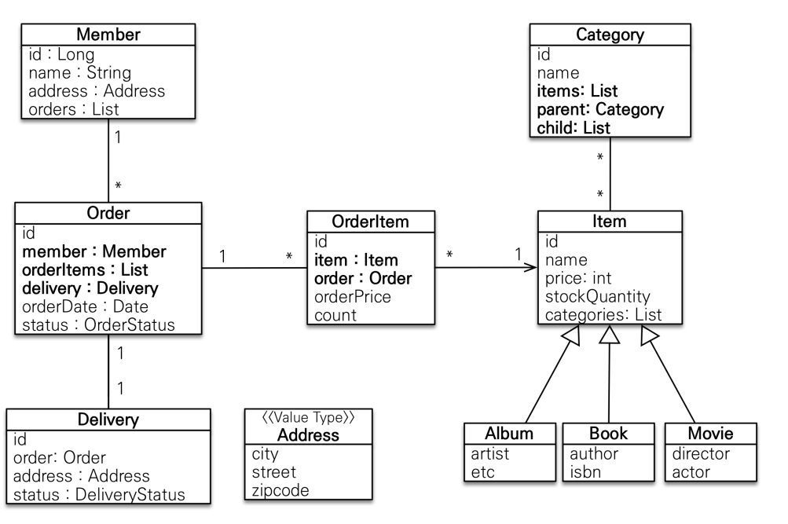

## kafka 도입
- 문제 인식
  - 주문 완료에 대한 하위 도메인의 부가적인 작업(API, DB작업) 실패로 인한 전체 작업에 영향이 발생 
  - 이벤트가 많아질 수록 수평적 확정성이 필요하나, 동기 통신으로는 역부족
- 효과
  - 각자의 역할에 맞게 나눠 안정성과 유지보수성 증가
  - 느슨하게 연결이 되어있어서 확장성과 장애 대응 효과
  - 동기처리를 비동기처리로 처리량 향상

## 브랜치 전략
- master(main) 
  - production에 출시가 가능한 브랜치
- release 
  - 개발이 완료되어 출시를 위해 준비하는 브랜치
- develop 
  - 개발이 완료된 최신 브랜치이자 신규 개발된 내역이 처음 합쳐지는 브랜치
- feature 
  - 각 기능을 개발하는 브랜치
- hotfix
  - production에 배포 된 버전에서 발생한 버그를 수정하는 브랜치

## ERD 
